# 🍴 FoodieHub - Restaurant Mobile App

<div align="center">
  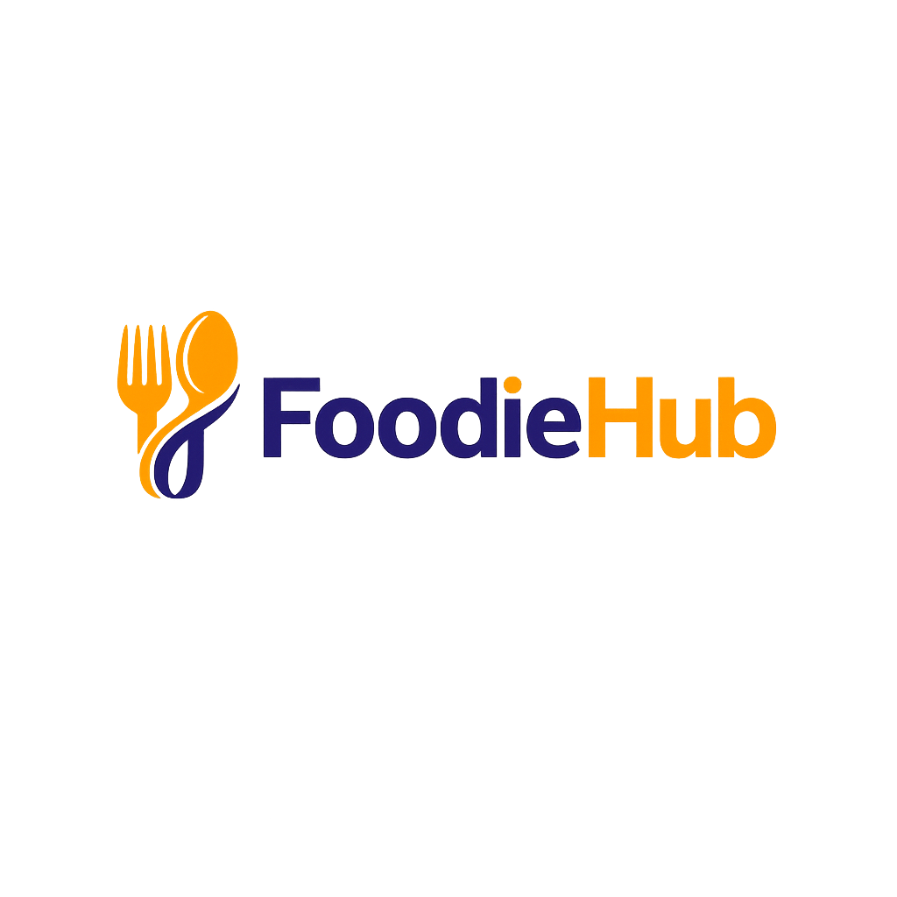
  
  ### *Your favourite food, delivered fast* 🚀
  
  
  
  
  
  

</div>

---

## 📱 About FoodieHub

**FoodieHub** is a full-stack restaurant mobile application built with **React Native & Expo Go**. It allows users to browse food items by category, add items to cart, place orders, make payments, and view their order history — all from their mobile device.

---

## ✨ Key Features

- 🔐 **User Authentication** — Secure Register & Login with JWT tokens
- 🏠 **Home Screen** — Browse all food items with category filters
- 🍔 **Category Filter** — Fast Food, Pizza, Chinese, Desi Food
- 🔍 **Search** — Search food items by name
- 🛒 **Cart Management** — Add, remove, increment/decrement items
- 💳 **Payment Processing** — Secure payment with card details
- 🧾 **Payment Receipt** — View detailed payment confirmation
- 📦 **Order History** — Track all past orders with token numbers
- 👤 **User Profile** — View and edit personal information
- 💤 **Splash Screen** — Beautiful branded loading screen

---

## 📸 Screenshots

| Splash Screen | Login | Register |
|---|---|---|
| 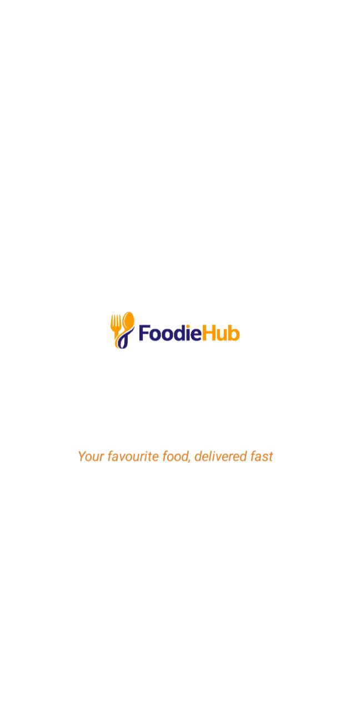 | 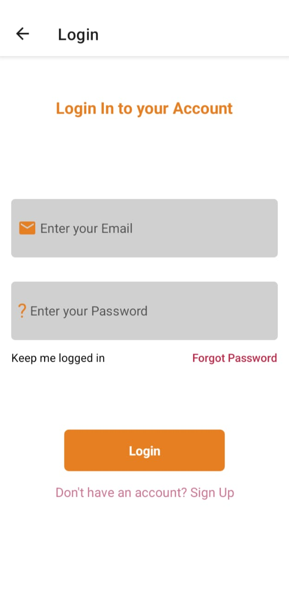 | 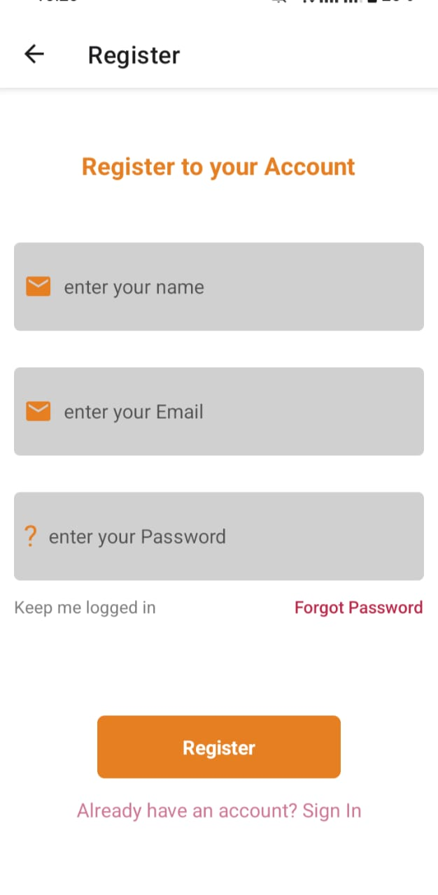 |

| Home Screen | Categories | Cart |
|---|---|---|
| 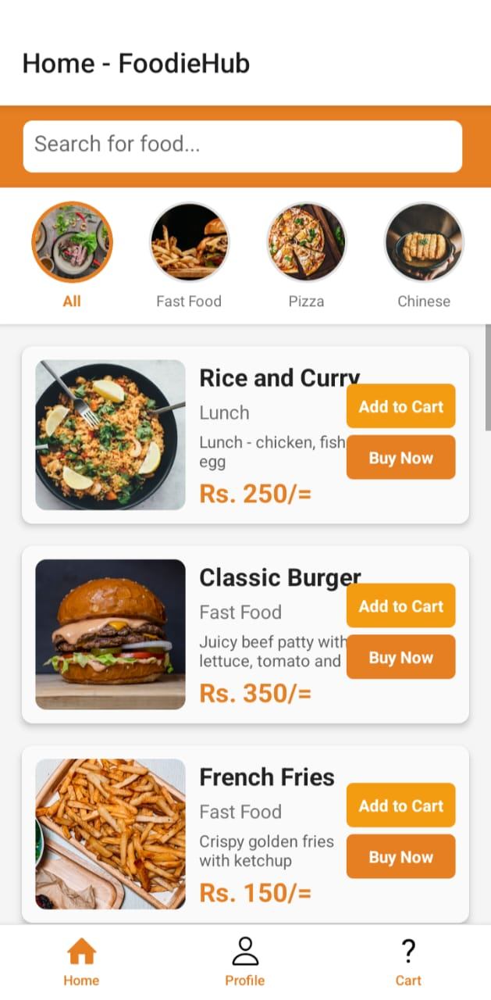 | 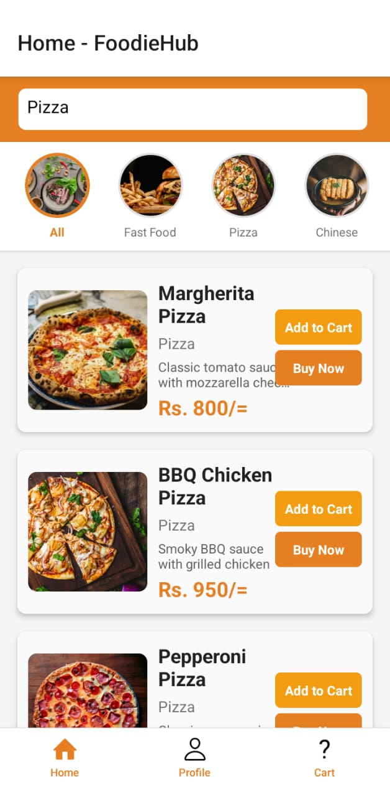 | 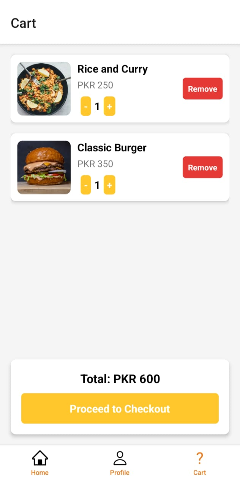 |

| Payment | Receipt | Profile |
|---|---|---|
| 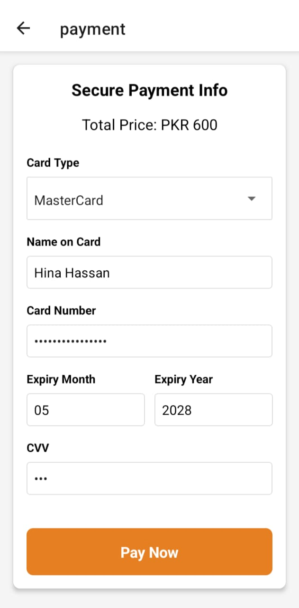 | 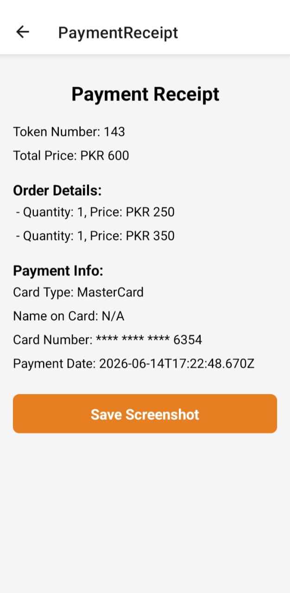 | 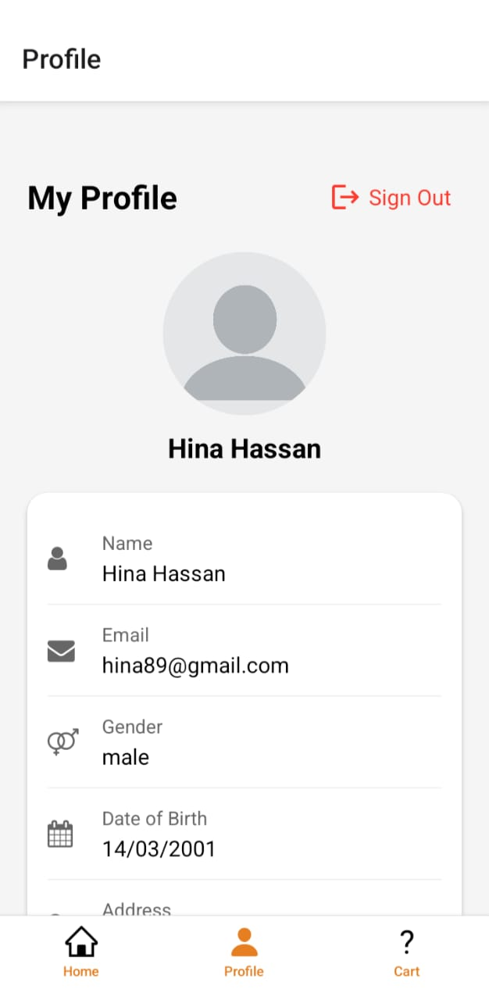 |

| Order History |
|---|
| 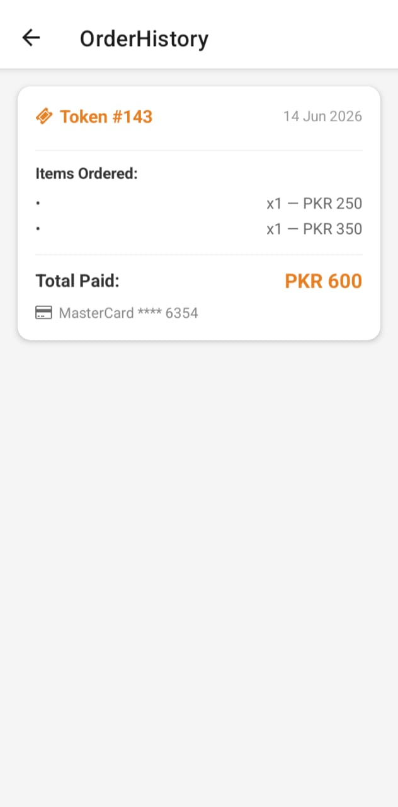 |

---

## 🛠️ Technologies Used

### Frontend
| Technology | Purpose |
|---|---|
| React Native | Mobile UI Framework |
| Expo Go | Development & Testing |
| Redux Toolkit | State Management (Cart) |
| React Navigation | Screen Navigation |
| AsyncStorage | Local Token Storage |
| JWT Decode | Token Decoding |

### Backend
| Technology | Purpose |
|---|---|
| Node.js | Runtime Environment |
| Express.js | Web Framework |
| MongoDB | Database |
| Mongoose | ODM |
| bcryptjs | Password Hashing |
| jsonwebtoken | Authentication |
| dotenv | Environment Variables |

---

## 📁 Project Structure

```
FoodieHub/
├── 📁 screen/
│   ├── SplashScreen.js
│   ├── LoginScreen.js
│   ├── RegisterScreen.js
│   ├── HomeScreen.js
│   ├── CartScreen.js
│   ├── ShoppingCartScreen.js
│   ├── PaynowScreen.js
│   ├── PaymentScreen.js
│   ├── ProfileScreen.js
│   ├── EditProfileScreen.js
│   └── OrderHistoryScreen.js
├── 📁 navigation/
│   └── StackNavigator.js
├── 📁 redux/
│   └── CartReducer.js
├── 📁 assets/
│   └── images/
├── App.js
├── UserContext.js
└── store.js
```

---

## 🚀 Getting Started

### Prerequisites
- Node.js installed
- Expo Go app on your phone
- npm package manager

### Installation

**1. Clone the repository**
```bash
git clone https://github.com/Basma-Hassan95/foodieHub-frontend.git
cd foodieHub-frontend
```

**2. Install dependencies**
```bash
npm install
```

**3. Start the app**
```bash
npx expo start
```

**4. Scan QR code** with Expo Go app on your phone ✅

---

## 🌐 Backend

The backend is deployed on **Railway** and connected to **MongoDB Atlas**.

- Backend Repo: [foodieHub-backend](https://github.com/Basma-Hassan95/foodieHub-backend)
- Live API: `https://foodiehub-backend-production.up.railway.app`

### API Endpoints

| Method | Endpoint | Description |
|---|---|---|
| POST | /register | Register new user |
| POST | /login | Login user |
| GET | /getAllFoods | Get all food items |
| GET | /user/:userId | Get user profile |
| PUT | /user/:userId | Update user profile |
| POST | /savepayment | Save payment details |
| GET | /getOrdersByUser/:userId | Get order history |

---

## 📱 App Screens

1. **Splash Screen** — Branded loading screen with FoodieHub logo
2. **Register Screen** — New user registration
3. **Login Screen** — User authentication
4. **Home Screen** — Food items with category filters & search
5. **Cart Screen** — Manage cart items
6. **Shopping Cart Screen** — Review order before payment
7. **Payment Screen** — Enter card details & process payment
8. **Payment Receipt** — View payment confirmation & token number
9. **Profile Screen** — View user details & order history
10. **Edit Profile Screen** — Update personal information
11. **Order History Screen** — View all past orders

---

## 👩‍💻 Developer

**Basma Hassan**

[](https://github.com/Basma-Hassan95)

---

## 📄 License

This project is open source and available under the [MIT License](LICENSE).

---

<div align="center">
  Made with ❤️ by Basma Hassan
</div>
